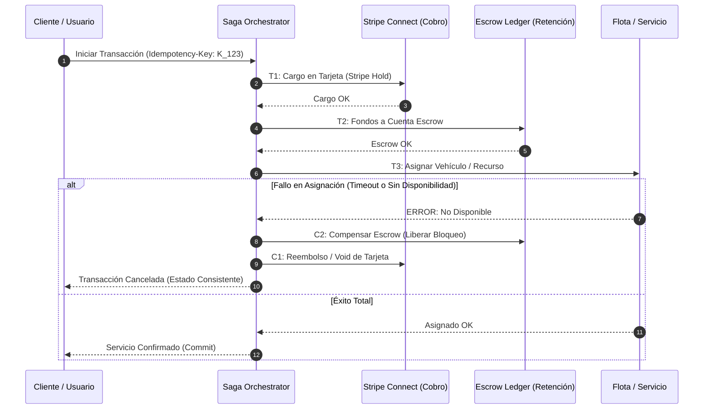

# 💳 Cátedra de Fintech, Stripe Connect, Sagas & Double-Entry Ledger (Nivel Stanford / Stripe)
## *Facultad X: Idempotencia Transaccional, Patrón Sagas Compensatorias, Escrow y Contabilidad de Partida Doble*

---

### 🏛️ 1. Principios de Contabilidad de Partida Doble (*Double-Entry Bookkeeping*)

En el procesamiento financiero corporativo (Stripe Connect, Escrow y liquidación de verticales como [`ProyectoTokenRWA`](file:///home/jaruiz/Desarrollo/apps/ProyectoTokenRWA) o [`AppViajes`](file:///home/jaruiz/Desarrollo/AppViajes)), **ningún saldo se incrementa o decrementa de forma aislada**. Cada transacción se compone de al menos dos apuntes contables (Débito y Crédito) cuya suma neta debe ser exactamente cero:

$$\sum_{i=1}^{k} \text{Debit}_i - \sum_{j=1}^{m} \text{Credit}_j = 0$$

#### Invariante de Conservación de Capital
Para cualquier cuenta contable \(A\), el saldo en el instante \(t\) es la integral discreta de todos sus movimientos históricos inmutables:
$$\text{Balance}(A, t) = \text{Balance}(A, 0) + \sum_{\tau \le t} \Delta_{\text{debit}}(A, \tau) - \sum_{\tau \le t} \Delta_{\text{credit}}(A, \tau)$$

---

### 🔁 2. Patrón Sagas Orquestadas con Acciones Compensatorias

Dado que las transacciones ACID distribuidas (2PC / Two-Phase Commit) introducen bloqueos síncronos incompatibles con la escala cloud-native, se implementa el **Patrón Sagas**:

#### Idempotencia Estricta
Toda petición externa hacia APIs de pago o endpoints transaccionales debe incluir un encabezado `Idempotency-Key` respaldado por almacenamiento distribuido:
- Si la clave ya fue procesada en la ventana de deduplicación (24 horas), se devuelve la respuesta en caché sin reejecutar la lógica de cobro.
- Erradicación garantizada del fallo de doble cobro (*Double-Spend Protection*).

---

### 💡 3. Analogía Feynman (La Balanza de Dos Platos de Luca Pacioli)

* **Metáfora de la Balanza Inmutable:**
  Imagina una balanza antigua de dos platos donde no puedes meter ni sacar monedas del aire. Si sacas 100 monedas de oro del cofre del cliente (Crédito), debes colocar exactamente esas mismas 100 monedas en el plato de la cuenta de depósito en garantía (*Escrow* / Débito). El peso total del universo contable no cambia jamás. Si un viaje o servicio se cancela a mitad de camino, la orquestación de Sagas retrocede ordenadamente devolviendo cada moneda a su plato original.

---

### 📚 Bibliografía de Cátedra
- Garcia-Molina, H., & Salem, K. (1987). *Sagas*. ACM SIGMOD.
- Pacioli, L. (1494). *Summa de arithmetica, geometria, proportioni et proportionalita* (Tratado de Computis et Scripturis).
- Stripe Engineering (2024). *Designing robust and idempotent payment APIs*.
- Fowler, M. (2018). *Patterns of Distributed Transactions: Saga Pattern*.
