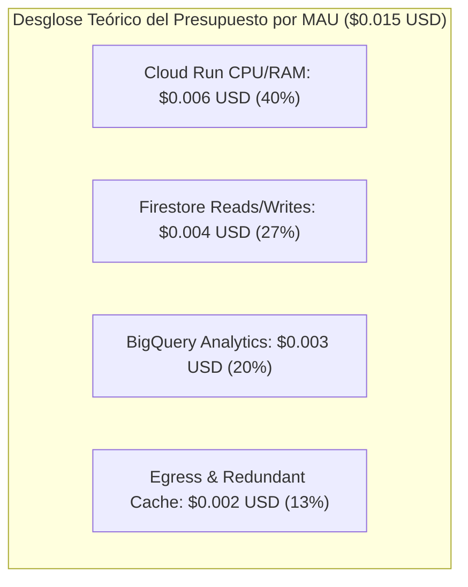
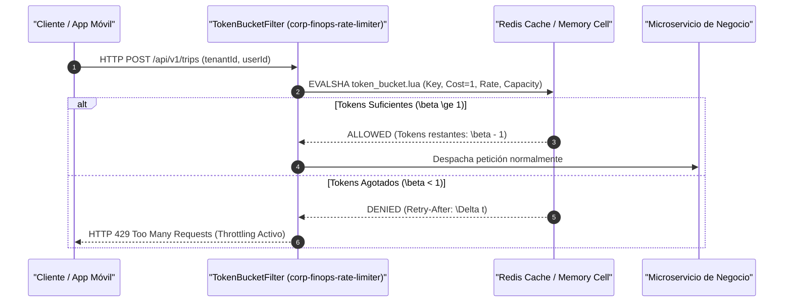

# Cátedra Ph.D.: Unit Economics FinOps (< 0.015 USD/MAU), Rate Limiting con Token Bucket y Control de Cuotas Serverless

**Facultad**: `FACULTAD_X` - Fintech, Stripe Connect, Sagas & Escrow  
**Referencia Académica**: RFC 2697 (Single Rate Three Color Marker / Token Bucket), J. Heinanen & R. Guerin (1999), FinOps Foundation Open Standards, Google Cloud Architecture Framework (Cost Optimization Pillar).  
**Instituciones**: IETF / FinOps Foundation / Stanford Graduate School of Business.

---

## 1. El Modelo Matemático de Unit Economics (< 0.015 USD/MAU/mes)

Para garantizar la viabilidad económica y escalabilidad infinita de una plataforma multi-tenant serverless, el coste marginal por usuario activo mensual (MAU) debe estar acotado de forma estricta:

$$\text{Coste Total}_{\text{MAU}} = C_{\text{CloudRun}} + C_{\text{Firestore}} + C_{\text{BigQuery}} + C_{\text{Red}} \le 0.015 \text{ USD}$$

---

## 2. Algoritmo de Control de Tráfico Token Bucket (RFC 2697)

Para evitar ataques de denegación de servicio (DoS) o bucles infinitos en clientes móviles que degraden el presupuesto FinOps, cada tenant y usuario está gobernado por un **Token Bucket distribuido en memoria Redis O(1)**:

$$\beta(t) = \min\left( \text{Capacity}, \beta(t - \Delta t) + \rho \cdot \Delta t \right)$$

* \(\text{Capacity}\): Ráfaga máxima permitida de peticiones instantáneas (*Burst Size*).
* \(\rho\): Tasa de recarga sostenida de tokens por segundo (*Refill Rate*).
* \(\beta(t)\): Cantidad de tokens disponibles en el instante \(t\).

---

## 3. Estrategias de Deduplicación y Liquidación Transaccional en Stripe Connect

1. **Clave de Idempotencia Forzosa**: Cada llamada a la API de Stripe transporta un header `Idempotency-Key: {tenantId}_{sagaId}_{txId}` que previene doble cargo ante reintentos de red TCP/IP.
2. **Escrow Hold en 2 Fases**: Los fondos del comprador se congelan mediante un *PaymentIntent* en estado `requires_capture` y solo se liberan a la cuenta conectada del vendedor tras la confirmación de entrega del servicio físico.
3. **Plataform Take Rate Algorítmico**: Cálculo determinista de comisiones de plataforma retenidas en origen sin retrasos de conciliación.

---

## 4. Invariantes de Gobernanza FinOps Six Sigma

1. **Particionado Forzoso en BigQuery**: Prohibida cualquier consulta SQL sin filtro `WHERE _PARTITIONDATE >= CURRENT_DATE() - N` para evitar escaneos de tablas completas.
2. **Throttling Automático en Cuotas de Vertex AI**: Las llamadas a modelos generativos deben encapsularse con limitadores de tokens y fallback a SLMs locales cuando se supera el \(80\%\) de la cuota mensual asignada.
3. **Cero Mocks en Pruebas Financieras**: Toda lógica de redondeo y comisiones debe probarse con stubs basados en propiedades con más de \(100.000\) transacciones simuladas.
