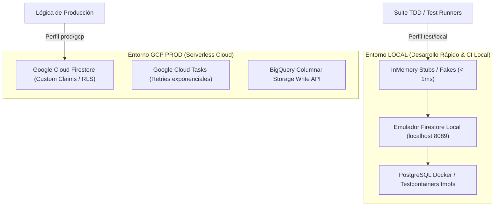

# 🥋 Kata 01: TDD Zero-Mockito y Pruebas Herméticas en Dominio Puro

---

## 🏛️ 1. Ancla Mental y Analogía Isomórfica (El Test de los 12 Años)

> **Analogía**: Imagina que estás probando un nuevo motor de avión.
> - **El enfoque Mockito tradicional**: En lugar de probar la física real de los engranajes, pones una maqueta de cartón pintada que siempre dice "sí, todo gira perfecto", sin importar si la fuerza aplicada tiene sentido. Si cambias un engranaje real por uno más eficiente, la maqueta de cartón se rompe porque esperaba el engranaje viejo, aunque el motor funcione mejor.
> - **El enfoque Zero-Mockito (Hermético)**: Construyes un banco de pruebas real en miniatura con física exacta en memoria. El motor interactúa con piezas reales que calculan peso y fricción de verdad. Si el motor funciona en el banco en miniatura, funcionará en el aire.

---

## 🔬 2. Primeros Principios: Por Qué Prohibimos Mockito en el Dominio

1. **Fragilidad ante el Refactor**: Los tests con `when(mock.method()).thenReturn(...)` acoplan la prueba a la *implementación interna* en lugar de verificar el *comportamiento del contrato* (violación del Principio Abierto/Cerrado).
2. **Incompatibilidad con Virtual Threads (Project Loom) y AOT/Leyden**: Mockito utiliza generación dinámica de bytecode en runtime (CGLIB/ByteBuddy). Esto genera advertencias de reflexión profunda, degrada la velocidad de inicio AOT y puede causar bloqueos en *Carrier Threads*.
3. **Pérdida de Fidelidad Semántica**: Un mock de un repositorio devuelve lo que tú le obligas a devolver; un **Fake / Stub hermético in-memory** (ej. `ConcurrentHashMap`) valida de verdad colisiones de clave, idempotencia y consistencia de datos.

---

## 💻 3. Arquitectura de Código: Implementación en Java 25 y Go

### A. Java 25: Dominio Puro con Stub Hermético In-Memory

```java
// 1. Dominio Puro Inmutable (Record de Java 25)
public record UsuarioRegante(String id, String nombre, double balanceMetrosCubicos) {
    public UsuarioRegante {
        if (balanceMetrosCubicos < 0) {
            throw new IllegalArgumentException("El balance hídrico no puede ser negativo");
        }
    }

    public UsuarioRegante acreditarRiego(double volumen) {
        return new UsuarioRegante(id, nombre, this.balanceMetrosCubicos + volumen);
    }
}

// 2. Puerto de Salida (Interface DDD)
public interface ReganteRepositoryPort {
    Optional<UsuarioRegante> findById(String id);
    void save(UsuarioRegante regante);
}

// 3. Stub Hermético en Memoria (Zero Mockito) para Tests
public final class InMemoryReganteRepositoryStub implements ReganteRepositoryPort {
    private final Map<String, UsuarioRegante> storage = new ConcurrentHashMap<>();

    @Override
    public Optional<UsuarioRegante> findById(String id) {
        return Optional.ofNullable(storage.get(id));
    }

    @Override
    public void save(UsuarioRegante regante) {
        storage.put(regante.id(), regante);
    }

    public void clear() {
        storage.clear();
    }
}

// 4. Test Hermético de Alta Velocidad (< 5ms)
class AsignacionRiegoServiceTest {
    private InMemoryReganteRepositoryStub repositoryStub;
    private AsignacionRiegoService service;

    @BeforeEach
    void setUp() {
        repositoryStub = new InMemoryReganteRepositoryStub();
        service = new AsignacionRiegoService(repositoryStub);
    }

    @Test
    void debeAcreditarAguaCorrectamenteSinMocks() {
        var regante = new UsuarioRegante("comunero-42", "Juan Ruiz", 100.0);
        repositoryStub.save(regante);

        service.ejecutarAcreditacion("comunero-42", 50.0);

        var actualizado = repositoryStub.findById("comunero-42").orElseThrow();
        assertEquals(150.0, actualizado.balanceMetrosCubicos());
    }
}
```

---

## ⚡ 4. Internals Avanzados: Dualidad Entornos LOCAL vs GCP



* **Local / CI**: El 100% de la suite de pruebas unitarias corre contra stubs in-memory o emuladores locales en `tmpfs`. Cero llamadas a servicios de red externos, cero costes en la factura de GCP.
* **GCP Cloud Run**: Los adaptadores reales de infraestructura inyectan los clientes gestionados de Google Cloud mediante Secret Manager y credenciales seguras (Workload Identity Federation).

---

## 🧠 5. Desafío Feynman y Rúbrica de Auto-Evaluación

> **Reto Feynman**: Explica a un estudiante de primer curso por qué es mejor escribir una clase simple con un `ConcurrentHashMap` que usar `@Mock` y `@InjectMocks`.

### Rúbrica de Evaluación:
1. **Nivel 1 (Básico)**: Identifica que los stubs no requieren anotaciones complejas de librerías externas.
2. **Nivel 2 (Intermedio)**: Explica que los stubs in-memory se ejecutan en microsegundos y no rompen con cambios internos de nombres de métodos privados.
3. **Nivel 3 (Ph.D. / Staff)**: Demuestra cómo el desacoplamiento de Mockito permite compatibilidad total AOT con Project Leyden CDS y elimina el riesgo de *Carrier Thread Pinning* en Java 25 Loom.
