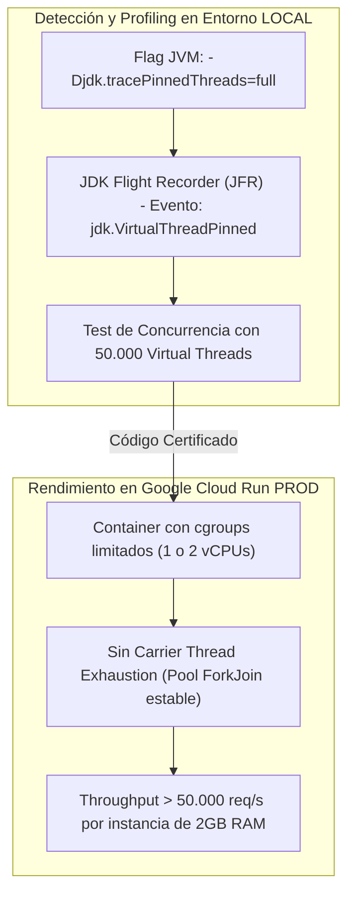

# 🥋 Kata 02: Concurrencia con Virtual Threads (Java 25 Loom) y Erradicación del Carrier Thread Pinning

---

## 🏛️ 1. Ancla Mental y Analogía Isomórfica (El Test de los 12 Años)

> **Analogía**: Imagina una cuadrilla de 8 trabajadores de reparto en camiones pesados (los *Carrier Threads* del sistema operativo) y 10.000 paquetes ligeros (los *Virtual Threads*).
> - **Comportamiento Óptimo (Loom Cooperativo)**: El repartidor llega a una puerta, timbra, y como el cliente tarda en abrir (operación de I/O de red), el repartidor no se queda parado; deja el paquete esperando solo y se va a entregar otros 500 paquetes. Cuando el cliente abre, el repartidor que esté libre completa la entrega.
> - **El Desastre del Pinning (`synchronized`)**: El repartidor se esposa físicamente a la puerta con candado (`synchronized`). Mientras espera que el cliente abra, ni él ni su camión pueden moverse. Si 8 paquetes hacen esto a la vez, toda la empresa de envíos se detiene por completo, aunque haya miles de paquetes esperando.

---

## 🔬 2. Primeros Principios: Mecánica del Runtime de Java 25

1. **Continuaciones Delimitadas (*Delimited Continuations*)**: Los Virtual Threads guardan su pila de llamadas (*stack frame*) en el montículo (*heap*) de la JVM y se desmontan (*unmount*) cuando entran en un estado de espera (I/O, `Thread.sleep`, colas bloqueantes).
2. **Causa Raíz del Pinning**: Cuando un Virtual Thread entra en un bloque `synchronized` o invoca una función nativa JNI, la JVM ancla el hilo virtual al hilo de plataforma subyacente. Si ocurre una operación de I/O dentro del bloque anclado, el *Carrier Thread* queda congelado, provocando degradación catastrófica del throughput.
3. **Solución Arquitectónica**: Sustituir `synchronized` por `java.util.concurrent.locks.ReentrantLock` o migrar datos inmutables contextuales a `java.lang.ScopedValue`.

---

## 💻 3. Arquitectura de Código: Refactorización Anti-Pinning

### A. Patrón Anti-Pinning con `ReentrantLock` y `ScopedValue`

```java
public class NonBlockingPaymentGateway {
    // Inyección de contexto inmutable sin overhead de ThreadLocal
    public static final ScopedValue<String> TENANT_ID = ScopedValue.newInstance();
    public static final ScopedValue<String> TRACE_ID = ScopedValue.newInstance();

    private final ReentrantLock processingLock = new ReentrantLock();

    // ❌ ANTI-PATRÓN: synchronized bloquea el Carrier Thread durante la llamada HTTP
    // public synchronized String processPayment(String payload) { ... }

    // ✅ PATRÓN CORRECTO: ReentrantLock permite que Loom desmonte el hilo virtual
    public String processPayment(String payload) {
        processingLock.lock();
        try {
            // I/O de red simulado (I/O no bloqueante desmontable en Loom)
            return executeExternalRestCall(payload);
        } finally {
            processingLock.unlock();
        }
    }

    private String executeExternalRestCall(String payload) {
        // En Java 25, HttpClient usa internamente Virtual Threads limpios
        return "PAYMENT_PROCESSED_TENANT_" + TENANT_ID.orElse("default");
    }
}
```

---

## ⚡ 4. Internals Avanzados: Diagnóstico JFR y Dualidad LOCAL vs GCP



* **Detección Local**: En tests locales, ejecutar la JVM con `-Djdk.tracePinnedThreads=full`. Si cualquier librería o código intenta anclar un hilo durante I/O, la consola imprimirá la traza exacta de la pila.
* **GCP Cloud Run**: En entornos con recursos restringidos (ej. 1 vCPU en Cloud Run), un solo evento de pinning puede causar un bloqueo del 100% de la CPU. La eliminación del pinning permite que una instancia de solo 1 vCPU maneje decenas de miles de conexiones HTTP concurrentes concurrentemente.

---

## 🧠 5. Desafío Feynman y Rúbrica de Auto-Evaluación

> **Reto Feynman**: Si un hilo virtual no es un hilo real del sistema operativo, ¿dónde se guarda lo que estaba haciendo cuando se va a esperar que llegue una respuesta de internet?

### Rúbrica de Evaluación:
1. **Nivel 1 (Básico)**: Explica que se guarda en la memoria RAM (Heap) como si fuese un objeto normal.
2. **Nivel 2 (Intermedio)**: Detalla que la JVM congela su pila (*stack frame*) y libera el hilo físico para atender otras peticiones.
3. **Nivel 3 (Ph.D. / Staff)**: Explica el mecanismo de continuaciones de Java 25, la interacción con el planificador `ForkJoinPool` y por qué `synchronized` impide el guardado en el heap al atar el frame al registro nativo del procesador.
