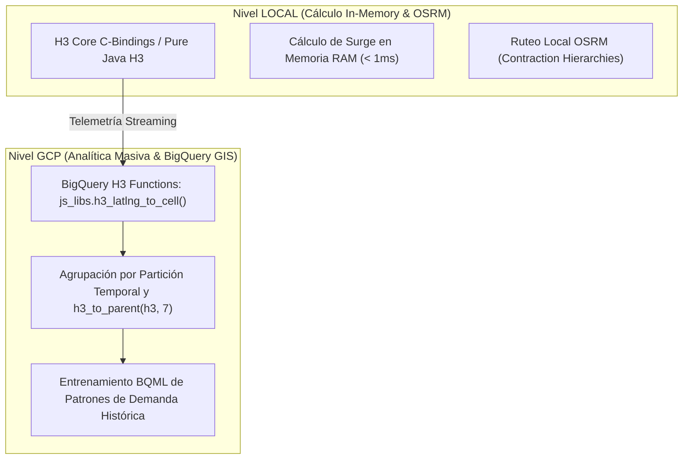

# 🥋 Kata 03: Indexación Geoespacial Hexagonal (Uber H3) y Tarifas Dinámicas (Surge Pricing)

---

## 🏛️ 1. Ancla Mental y Analogía Isomórfica (El Test de los 12 Años)

> **Analogía**: Imagina que tienes un mapa del mundo y quieres saber si dos personas están cerca para compartir un taxi o si en una zona hay más gente pidiendo viajes que coches disponibles.
> - **El enfoque de Cuadrículas o Círculos Tradicional**: Si divides el mapa en cuadrados, las esquinas están más lejos del centro que los lados (distancia no uniforme). Si usas círculos, quedan huecos vacíos y zonas solapadas.
> - **El enfoque Hexagonal Uber H3 (El Panal de Abejas)**: Los hexágonos encajan a la perfección sin dejar huecos. Cada hexágono tiene exactamente 6 vecinos a la misma distancia exacta. Además, cada hexágono tiene una dirección numérica única (un número de 64 bits), por lo que saber si estás en la misma zona es tan rápido como comparar dos números en un microchip.

---

## 🔬 2. Primeros Principios: Geometría Discreta y Complejidad Asintótica \(\mathcal{O}(1)\)

1. **Partición Icosaédrica Global**: Uber H3 proyecta la Tierra sobre un icosaedro y subdivide cada cara en hexágonos recursivos de 16 niveles de resolución (Resolución 7: ~1.2 km², Resolución 8: ~0.7 km², Resolución 9: ~0.1 km²).
2. **Cálculo de Escasez y Multiplicador Surge en \(\mathcal{O}(1)\)**:
   \[
   S(h) = 1.0 + \alpha \cdot \max\left(0, \frac{D(h) - k \cdot O(h)}{O(h) + \epsilon}\right)
   \]
   Donde \(D(h)\) es la demanda en la celda \(h\), \(O(h)\) es la oferta de vehículos/recursos, \(\alpha\) es el factor de sensibilidad y \(\epsilon\) es el buffer de amortiguación de ruido.

---

## 💻 3. Arquitectura de Código: Implementación en Java 25

```java
public final class H3SurgePricingEngine {
    private static final double BASE_MULTIPLIER = 1.0;
    private static final double MAX_SURGE_CAP = 3.5;
    private static final double ALPHA_SENSITIVITY = 0.8;
    private static final double EPSILON_STABILIZER = 1.0;

    // Estructuras de datos concurrentes en memoria de alta velocidad
    private final ConcurrentHashMap<Long, LongAdder> demandPerCell = new ConcurrentHashMap<>();
    private final ConcurrentHashMap<Long, LongAdder> supplyPerCell = new ConcurrentHashMap<>();

    public void registerDemand(long h3Index) {
        demandPerCell.computeIfAbsent(h3Index, k -> new LongAdder()).increment();
    }

    public void registerSupply(long h3Index) {
        supplyPerCell.computeIfAbsent(h3Index, k -> new LongAdder()).increment();
    }

    public double calculateSurgeMultiplier(long h3Index) {
        long demand = demandPerCell.getOrDefault(h3Index, new LongAdder()).sum();
        long supply = supplyPerCell.getOrDefault(h3Index, new LongAdder()).sum();

        if (demand <= supply) {
            return BASE_MULTIPLIER;
        }

        double excessRatio = (double) (demand - supply) / (supply + EPSILON_STABILIZER);
        double calculatedSurge = BASE_MULTIPLIER + (ALPHA_SENSITIVITY * excessRatio);

        // Clamping estricto para evitar picos predatorios
        return Math.min(MAX_SURGE_CAP, Math.max(BASE_MULTIPLIER, calculatedSurge));
    }
}
```

---

## ⚡ 4. Internals Avanzados: Dualidad LOCAL vs GCP BigQuery GIS



* **Operativa en Tiempo Real (Local / Cloud Run)**: El cálculo del precio dinámico se ejecuta en la instancia de Cloud Run en memoria en \(< 0.1\text{ ms}\) utilizando índices H3 de 64 bits (`long`). Cero latencia de base de datos.
* **Analítica y ML (GCP BigQuery GIS)**: Los registros se agregan en BigQuery particionado por fecha y agrupados por `h3_to_parent(h3_index, 7)` para entrenar modelos de regresión predictiva (BQML) sin coste de compute continuo.

---

## 🧠 5. Desafío Feynman y Rúbrica de Auto-Evaluación

> **Reto Feynman**: ¿Por qué las abejas usan hexágonos para sus panales y por qué los ingenieros de Uber y Antigravity los usamos para los mapas en lugar de cuadrados?

### Rúbrica de Evaluación:
1. **Nivel 1 (Básico)**: Explica que los hexágonos cubren todo el espacio sin dejar huecos y que todos los vecinos están a la misma distancia.
2. **Nivel 2 (Intermedio)**: Muestra cómo un punto GPS se convierte en un simple número entero que identifica una baldosa exacta.
3. **Nivel 3 (Ph.D. / Staff)**: Explica la distorsión reducida de la proyección icosaédrica de H3 frente a Mercator y demuestra la complejidad $\mathcal{O}(1)$ de la búsqueda en k-ring hexagonal frente a polígonos vectoriales en PostgreSQL PostGIS.
