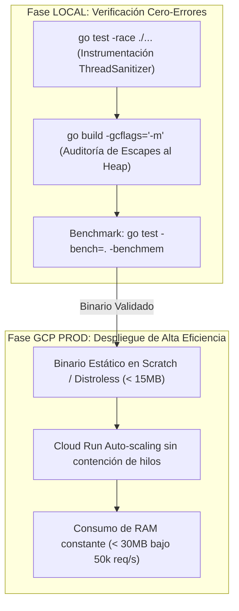

# 🥋 Kata 04: Concurrencia Go CSP, Race Detector y Zero-Allocation Memory Pools

---

## 🏛️ 1. Ancla Mental y Analogía Isomórfica (El Test de los 12 Años)

> **Analogía**: Imagina una cocina con 10 cocineros y una pizarra común.
> - **El caos de la memoria compartida (*Data Race*)**: Dos cocineros intentan escribir en el mismo trozo de pizarra a la vez con tizas distintas. El mensaje queda emborronado y el pedido sale quemado o equivocado.
> - **El modelo CSP de Go (*Communicating Sequential Processes*)**: En lugar de pelearse por la pizarra, cada cocinero tiene su propia libreta y se pasan platos terminados a través de una cinta transportadora segura (un **canal** de Go). Nadie toca la libreta de otro; la información se transmite entregando el plato.

---

## 🔬 2. Primeros Principios: Concurrencia CSP y Análisis de Escapes

1. **Axioma de Go**: *"No te comuniques compartiendo memoria; comparte memoria comunicándote"*.
2. **Data Race**: Ocurre cuando dos o más goroutines acceden a la misma posición de memoria de forma concurrente y al menos uno de los accesos es de escritura, sin sincronización explícita.
3. **Zero-Allocations en Hot Paths**: Evitar que los datos escapen al heap mediante el uso de `sync.Pool` para buffers de red, reduciendo las pausas del recolector de basura (GC) a cero microsegundos.

---

## 💻 3. Arquitectura de Código: Worker de Red en Go 1.24+

```go
package main

import (
	"context"
	"fmt"
	"sync"
	"time"
)

type TelemetryBatch struct {
	DeviceID  string
	Readings  []float64
	Timestamp int64
}

// Pool de memoria para reutilizar estructuras sin alocar en el Heap
var batchPool = sync.Pool{
	New: func() any {
		return &TelemetryBatch{
			Readings: make([]float64, 0, 64),
		}
	},
}

type TelemetryDispatcher struct {
	incomingChannel chan *TelemetryBatch
	workerCount     int
	wg              sync.WaitGroup
}

func NewTelemetryDispatcher(workerCount, queueBuffer int) *TelemetryDispatcher {
	return &TelemetryDispatcher{
		incomingChannel: make(chan *TelemetryBatch, queueBuffer),
		workerCount:     workerCount,
	}
}

func (d *TelemetryDispatcher) Start(ctx context.Context) {
	for i := 0; i < d.workerCount; i++ {
		d.wg.Add(1)
		go d.workerLoop(ctx, i)
	}
}

func (d *TelemetryDispatcher) workerLoop(ctx context.Context, workerID int) {
	defer d.wg.Done()
	for {
		select {
		case <-ctx.Done():
			return
		case batch, ok := <-d.incomingChannel:
			if !ok {
				return
			}
			d.processBatch(batch)
			// Devolver al pool tras el procesamiento
			batch.Readings = batch.Readings[:0]
			batchPool.Put(batch)
		}
	}
}

func (d *TelemetryDispatcher) processBatch(batch *TelemetryBatch) {
	// Procesamiento en microsegundos
	_ = fmt.Sprintf("Processed device: %s with %d points", batch.DeviceID, len(batch.Readings))
}
```

---

## ⚡ 4. Internals Avanzados: Race Detector y Dualidad LOCAL vs GCP



* **Detección Local**: Todo commit debe pasar `go test -race ./...`. El flag `-race` instrumenta las lecturas y escrituras con ThreadSanitizer, detectando cualquier colisión de acceso concurrente antes de llegar a producción.
* **GCP Cloud Run**: Un worker en Go compilado estáticamente arranca en $< 15\text{ ms}$ y consume menos de 30 MB de RAM en Cloud Run, permitiendo escalar de 0 a 100 instancias de forma prácticamente instantánea.

---

## 🧠 5. Desafío Feynman y Rúbrica de Auto-Evaluación

> **Reto Feynman**: Si dos goroutines quieren sumar 1 a la misma variable al mismo tiempo, ¿por qué el resultado puede ser 1 en lugar de 2 si no usamos un canal o un atomic?

### Rúbrica de Evaluación:
1. **Nivel 1 (Básico)**: Explica que la computadora hace tres pasos (leer, sumar, guardar) y si se cruzan, una operación sobreescribe a la otra.
2. **Nivel 2 (Intermedio)**: Detalla la pérdida de consistencia a nivel de registros de CPU y memoria caché.
3. **Nivel 3 (Ph.D. / Staff)**: Explica la arquitectura de memoria SMP, la incoherencia de caché L1/L2, las instrucciones atómicas `LOCK CMPXCHG` en x86/ARM y cómo el *Race Detector* de Go detecta violaciones en el grafo de orden causal de Lamport.
