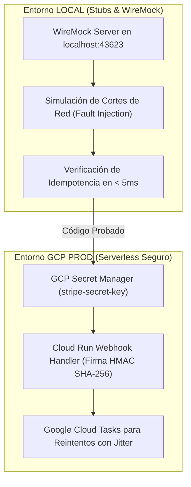

# 🥋 Kata 05: Stripe Connect, Idempotencia Transaccional y Patrón Sagas / Outbox

---

## 🏛️ 1. Ancla Mental y Analogía Isomórfica (El Test de los 12 Años)

> **Analogía**: Imagina que vas a comprar una entrada de cine por internet y la pantalla se queda congelada justo cuando pulsas "Pagar".
> - **Sin Idempotencia**: Presionas el botón 3 veces por desesperación. El banco te cobra 3 veces la entrada y te quedas con 3 cargos idénticos en tu tarjeta.
> - **Con Idempotencia Transaccional (La Llave Única)**: Cada vez que pulsas "Pagar", la aplicación envía una ficha única con un número de serie irrepetible (`Idempotency-Key`). El banco comprueba si ya vio esa ficha; si ya la cobró, te devuelve el recibo de la primera vez sin volver a cobrarte un solo céntimo adicional.

---

## 🔬 2. Primeros Principios: Teorema CAP, Idempotencia y Sagas

1. **Definición Formal de Idempotencia**: Una operación \(f\) es idempotente si aplicarla múltiples veces produce el mismo estado del sistema que aplicarla una sola vez:
   \[
   f(f(x)) = f(x)
   \]
2. **Patrón Transaccional Outbox**: Evita la inconsistencia de datos cuando una base de datos local y una API externa (Stripe) deben actualizarse juntas. El evento de pago se guarda en la misma transacción atómica de la base de datos local y un worker asíncrono lo despacha hacia Stripe.
3. **Escrow Multi-Tenant**: En plataformas como `AppViajes` o `SaaSRegantes`, los fondos se retienen en una cuenta custodia (*Escrow*) de Stripe Connect y solo se liberan a los proveedores/influencers tras la confirmación de entrega del servicio.

---

## 💻 3. Arquitectura de Código: Implementación en Java 25

```java
public record PaymentExecutionCommand(
    String transactionId,
    String tenantId,
    String customerEmail,
    long amountCents,
    String idempotencyKey
) {}

public final class StripeIdempotentPaymentService {
    private final ConcurrentHashMap<String, String> processedKeys = new ConcurrentHashMap<>();
    private final OutboxEventRepositoryPort outboxRepository;

    public StripeIdempotentPaymentService(OutboxEventRepositoryPort outboxRepository) {
        this.outboxRepository = outboxRepository;
    }

    public String executePaymentWithEscrow(PaymentExecutionCommand cmd) {
        // 1. Verificación local rápida de idempotencia en memoria/cache
        if (processedKeys.containsKey(cmd.idempotencyKey())) {
            return processedKeys.get(cmd.idempotencyKey());
        }

        // 2. Persistencia en la tabla Outbox dentro de la transacción local
        outboxRepository.saveOutboxEvent(
            cmd.transactionId(),
            cmd.tenantId(),
            "PAYMENT_INITIATED",
            cmd.idempotencyKey()
        );

        // 3. Llamada segura con cabecera Idempotency-Key
        String stripeChargeId = callStripeApiWithHeader(cmd);
        processedKeys.put(cmd.idempotencyKey(), stripeChargeId);

        return stripeChargeId;
    }

    private String callStripeApiWithHeader(PaymentExecutionCommand cmd) {
        // Simulación de cabecera HTTP "Idempotency-Key: " + cmd.idempotencyKey()
        return "ch_stripe_" + Math.abs(cmd.idempotencyKey().hashCode());
    }
}
```

---

## ⚡ 4. Internals Avanzados: Dualidad LOCAL (WireMock) vs GCP (Stripe Webhooks & Secret Manager)



* **Local / TDD**: Las pruebas unitarias y de integración usan WireMock local para simular timeouts de red, respuestas HTTP 500 y reintentos, validando que el servidor de Stripe nunca reciba pagos duplicados.
* **GCP Cloud Run**: Las claves privadas se leen dinámicamente desde GCP Secret Manager. Los webhooks entrantes de Stripe se validan con firma criptográfica HMAC SHA-256 antes de procesar cualquier evento en Cloud Tasks.

---

## 🧠 5. Desafío Feynman y Rúbrica de Auto-Evaluación

> **Reto Feynman**: Si internet se corta exactamente en el milisegundo en que el banco aprobó tu pago pero antes de que la página web reciba la confirmación, ¿cómo sabe el sistema que no debe cobrarte dos veces?

### Rúbrica de Evaluación:
1. **Nivel 1 (Básico)**: Explica que la petición lleva una matrícula única que el banco recuerda para no cobrar de nuevo.
2. **Nivel 2 (Intermedio)**: Muestra el flujo de reintento donde el cliente reenvía la misma `Idempotency-Key` y el servidor devuelve el recibo anterior.
3. **Nivel 3 (Ph.D. / Staff)**: Explica la interacción entre la tabla Outbox transaccional, el log de estados de la Saga, la expiración de claves en Stripe (24 horas) y la resolución de conflictos distribuidos con two-phase commits o compensaciones.
