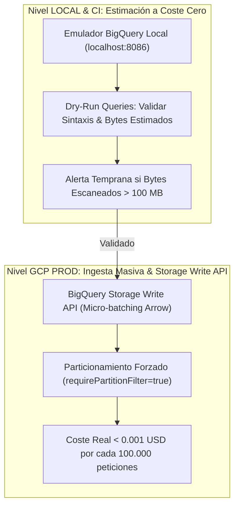

# 🥋 Kata 06: Optimización Analítica en BigQuery, Particionado Obligatorio y FinOps

---

## 🏛️ 1. Ancla Mental y Analogía Isomórfica (El Test de los 12 Años)

> **Analogía**: Imagina una biblioteca gigante con 10 millones de libros ordenados en estanterías por año y por ciudad.
> - **El Escaneo Completo (*Full Table Scan* Destructivo)**: Quieres saber cuántas manzanas se vendieron en Sevilla en mayo de 2026. Si el bibliotecario tiene que leer los 10 millones de libros enteros página por página, tardará horas y te cobrará una fortuna por el esfuerzo.
> - **El Particionado y Clustering (*BigQuery Columnar*)**: El bibliotecario va directamente a la estantería etiquetada `2026-05` (Partición) y al cajón `Sevilla` (Clustering). Solo abre un libro fino de 10 páginas. Tarda 0.2 segundos y te cobra menos de un céntimo.

---

## 🔬 2. Primeros Principios: Almacenamiento Columnar y Modelo de Costes de BigQuery

1. **Almacenamiento Capacitor**: BigQuery almacena los datos por columnas en lugar de por filas. El coste de una consulta depende estrictamente del volumen de bytes leídos en las columnas seleccionadas.
2. **Regla de Oro FinOps (`requirePartitionFilter=true`)**: En el ecosistema, **queda terminantemente prohibido** ejecutar queries sobre tablas analíticas sin filtrar por el campo de partición temporal (`_PARTITIONTIME` o columna `TIMESTAMP`).
3. **Clustering por `tenant_id`**: Dentro de cada partición diaria, los datos se ordenan físicamente por el identificador del inquilino, permitiendo lecturas en $\mathcal{O}(1)$ para consultas multi-tenant.

---

## 💻 3. Arquitectura de Código: DDL y Query FinOps Optimizada

```sql
-- 1. DDL de Tabla Analítica Optimizada en BigQuery
CREATE TABLE IF NOT EXISTS `itinera_analytics.telemetry_events`
(
    event_id STRING NOT NULL,
    tenant_id STRING NOT NULL,
    h3_index INT64 NOT NULL,
    metric_value FLOAT64,
    created_at TIMESTAMP NOT NULL
)
PARTITION BY DATE(created_at)
CLUSTER BY tenant_id, h3_index
OPTIONS (
    require_partition_filter = true,
    partition_expiration_days = 730
);

-- 2. Query FinOps Correcta (Lectura Mínima en Bytes)
-- ✅ BIEN: Filtra por partición temporal y por tenant clusterizado
SELECT
    h3_index,
    AVG(metric_value) AS promedio_metrica,
    COUNT(1) AS total_eventos
FROM `itinera_analytics.telemetry_events`
WHERE created_at >= TIMESTAMP_SUB(CURRENT_TIMESTAMP(), INTERVAL 7 DAY)
  AND tenant_id = 'tenant_andalucia_01'
GROUP BY h3_index;
```

---

## ⚡ 4. Internals Avanzados: Dualidad LOCAL (Emulador / Dry-Run) vs GCP PROD



* **Validación Local con Dry-Run**: Antes de desplegar una nueva consulta, el SDK ejecuta la llamada con `dryRun=true`. La API de Google Cloud devuelve la cantidad exacta de bytes que procesaría la consulta sin ejecutarla y a `$0.00 USD` de coste. Si la estimación supera los 100 MB para una consulta transaccional, el commit es vetado automáticamente.
* **Ingesta Streaming en GCP**: Los datos se envían a BigQuery mediante `BigQueryWriteClient` (Storage Write API) en micro-lotes de memoria, evitando las limitaciones y sobrecostes de la API REST clásica de streaming.

---

## 🧠 5. Desafío Feynman y Rúbrica de Auto-Evaluación

> **Reto Feynman**: ¿Por qué hacer `SELECT * FROM tabla` en BigQuery es como pedirle a un camarero que te traiga todos los platos de la carta cuando solo querías beber agua?

### Rúbrica de Evaluación:
1. **Nivel 1 (Básico)**: Explica que `SELECT *` obliga a la computadora a leer todas las columnas, aunque no las vayas a mirar, encareciendo la factura.
2. **Nivel 2 (Intermedio)**: Detalla que BigQuery cobra por gigabytes leídos del disco y que seleccionar solo 2 columnas específicas cuesta una fracción diminuta.
3. **Nivel 3 (Ph.D. / Staff)**: Explica el formato de compresión Capacitor, la estructura de metadatos de partición y cómo el podado de bloques (*Block Pruning*) mediante clustering reduce las operaciones de I/O de almacenamiento distribuido Colossus a tiempo logarítmico.
