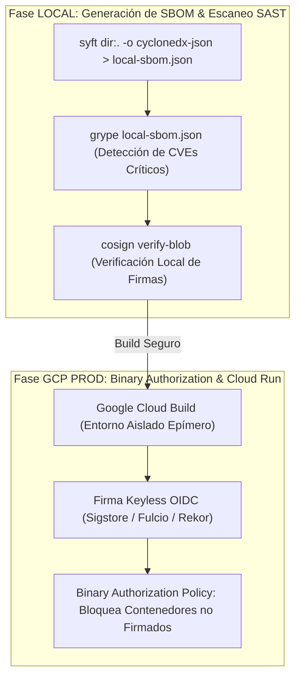

# 🥋 Kata 07: Seguridad en la Cadena de Suministro de Software, SLSA L3/L4 y Firmas Cosign / Sigstore

---

## 🏛️ 1. Ancla Mental y Analogía Isomórfica (El Test de los 12 Años)

> **Analogía**: Imagina una caja de medicinas en una farmacia.
> - **Sin Seguridad de Suministro (El Contenedor Anónimo)**: Compras una pastilla en un frasco sin etiqueta que alguien dejó en la puerta. No sabes quién la fabricó, qué ingredientes lleva, ni si alguien le metió veneno por el camino.
> - **Con SLSA L3 y Firmas Cosign (El Sello Inviolable con Cera Notarial)**: La caja viene con un código QR firmado por un laboratorio oficial certificado. El sello demuestra exactamente qué máquina la empaquetó, qué ingredientes se usaron (el **SBOM**), la hora exacta y garantiza que nadie abrió la caja durante el transporte. Si el sello está roto o la firma no coincide, el hospital rechaza el frasco al instante.

---

## 🔬 2. Primeros Principios: Marco SLSA (Supply-chain Levels for Software Artifacts)

1. **Nivel SLSA L3**: Requiere que el artefacto sea construido en un servicio de build aislado y hermético (ej. Google Cloud Build), con proveniencia inmutable generada automáticamente que verifique el commit fuente de Git, el builder y las dependencias utilizadas.
2. **Firmado Sin Claves (*Keyless Signing*) con Sigstore / Cosign**: En lugar de almacenar claves privadas estáticas en variables de entorno que puedan filtrarse, Cosign utiliza un token de identidad OIDC de corta duración (emitido por Google Cloud IAM) y registra la firma en un libro mayor de transparencia público e inmutable (Rekor).
3. **SBOM (Software Bill of Materials)**: Manifiesto estructurado (CycloneDX / SPDX) que lista todas las dependencias transitivas y sus hashes SHA-256 para auditoría de vulnerabilidades en tiempo real.

---

## 💻 3. Arquitectura de Código: Pipeline CloudBuild con Firma Cosign

```yaml
# cloudbuild.yaml - Pipeline Multi-Stage SLSA L3 & Cosign
steps:
  # 1. Compilación y Construcción del Contenedor Multi-Stage
  - name: 'gcr.io/kaniko-project/executor:latest'
    args:
      - '--destination=europe-west1-docker.pkg.dev/$PROJECT_ID/itinera-repo/backend-api:$SHORT_SHA'
      - '--cache=true'
      - '--dockerfile=Dockerfile'

  # 2. Generación de SBOM con Syft (CycloneDX JSON)
  - name: 'anchore/syft:latest'
    args:
      - 'europe-west1-docker.pkg.dev/$PROJECT_ID/itinera-repo/backend-api:$SHORT_SHA'
      - '-o'
      - 'cyclonedx-json'
      - '--file'
      - 'sbom.json'

  # 3. Firmado Criptográfico Keyless del Contenedor y del SBOM con Cosign
  - name: 'gcr.io/projectsigstore/cosign:latest'
    env:
      - 'COSIGN_EXPERIMENTAL=1'
    args:
      - 'sign'
      - '--yes'
      - 'europe-west1-docker.pkg.dev/$PROJECT_ID/itinera-repo/backend-api:$SHORT_SHA'
```

---

## ⚡ 4. Internals Avanzados: Dualidad LOCAL vs GCP Binary Authorization



* **Validación Local**: En local, los desarrolladores generan el SBOM con `syft` y escanean vulnerabilidades con `grype`. Cualquier dependencia con CVE crítico detiene el pipeline antes de hacer push.
* **GCP Binary Authorization**: En Google Cloud Kubernetes Engine (GKE) o Cloud Run, la política de admisión de *Binary Authorization* intercepta el despliegue y valida que la imagen del contenedor tenga una firma criptográfica válida de Cosign emitida por la cuenta de servicio autorizada de Cloud Build. Si una imagen no está firmada, el despliegue es rechazado a nivel de infraestructura.

---

## 🧠 5. Desafío Feynman y Rúbrica de Auto-Evaluación

> **Reto Feynman**: Si alguien hackea el ordenador de un programador y cambia una línea de código antes de enviar el contenedor a producción, ¿cómo lo detecta el servidor usando Cosign y SLSA?

### Rúbrica de Evaluación:
1. **Nivel 1 (Básico)**: Explica que el servidor comprueba la firma digital del contenedor y si el código fue alterado, la firma no coincide.
2. **Nivel 2 (Intermedio)**: Muestra que el proceso de compilación ocurre en una máquina segura en la nube (Cloud Build) que genera una prueba inmutable (*Attestation*) vinculada al commit oficial de Git.
3. **Nivel 3 (Ph.D. / Staff)**: Explica el protocolo de intercambio OIDC con Fulcio, la publicación del certificado efímero en el log de transparencia Rekor, la verificación criptográfica del hash del digest de la imagen y la validación en el Admission Controller de Kubernetes.
