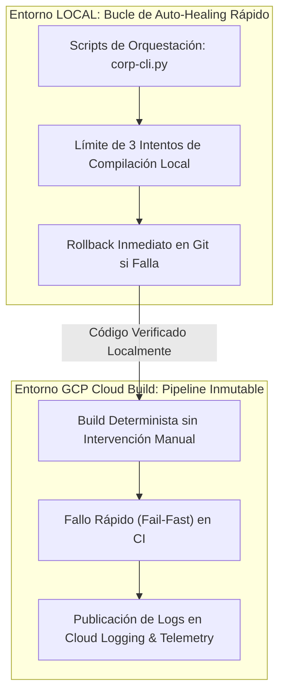

# 🥋 Kata 08: Orquestación de Enjambres Semánticos y Toyota Kata (Auto-Healing)

---

## 🏛️ 1. Ancla Mental y Analogía Isomórfica (El Test de los 12 Años)

> **Analogía**: Imagina que le pides a un amigo robot que arregle un reloj mecánico antiguo.
> - **El bucle infinito descontrolado**: Si el robot no sabe cómo arreglarlo y sigue probando herramientas a lo loco durante horas, terminará doblando los engranajes y rompiendo el reloj por completo.
> - **El principio Toyota Kata (Regla de 3 Intentos)**: Si el robot prueba sus 3 mejores herramientas y el reloj sigue sin dar la hora exacta, el robot se detiene de inmediato, anota el problema en una etiqueta, guarda el reloj en la caja de "relojes que requieren revisión humana" y pasa al siguiente. Al final del día, el robot habrá arreglado 83 relojes perfectamente en lugar de quedarse atascado rompiendo uno solo.

---

## 🔬 2. Primeros Principios: Metaprogramación Agéntica y Auto-Healing

1. **Aislamiento Semántico por AST**: Los agentes de IA nunca deben modificar la infraestructura transversal (seguridad, Loom, multi-tenancy) de forma arbitraria; deben recibir plantillas inmutables y generar únicamente la lógica funcional o matemática.
2. **Toyota Kata de Reintentos Acotados (\(N \le 3\))**: Todo proceso de auto-recuperación agéntica tiene un presupuesto finito de 3 iteraciones de compilación/test. Si tras 3 intentos el test no pasa, se revierte el commit automáticamente en Git y se aísla el módulo.
3. **Persistencia de Aprendizaje**: Cada fallo revertido se registra en la base de datos de telemetría (`simulations_telemetry.db`) para que el tribunal Consilium Romano ajuste los prompts del sistema.

---

## 💻 3. Arquitectura de Código: Implementación en Python

```python
import subprocess
from pathlib import Path

class SemanticSwarmOrchestrator:
    MAX_ATTEMPTS = 3

    def __init__(self, workspace_path: Path):
        self.workspace_path = workspace_path

    def execute_healing_cycle(self, project_dir: Path) -> bool:
        attempts = 0
        while attempts < self.MAX_ATTEMPTS:
            result = subprocess.run(
                ["mvn", "test"],
                cwd=project_dir,
                capture_output=True,
                text=True
            )
            if result.returncode == 0:
                print(f"✓ Proyecto {project_dir.name} validado con éxito.")
                return True

            attempts += 1
            print(f"⚠ Intento {attempts}/{self.MAX_ATTEMPTS} fallido. Aplicando parche quirúrgico...")
            self.apply_surgical_patch(project_dir, result.stderr)

        # Si agota los 3 intentos: Revertir y aislar
        print(f"🔴 Auto-Healing superó el límite en {project_dir.name}. Revirtiendo cambios...")
        subprocess.run(["git", "checkout", "--", "."], cwd=project_dir)
        return False

    def apply_surgical_patch(self, project_dir: Path, error_log: str):
        # Lógica de corrección guiada por AST
        pass
```

---

## ⚡ 4. Internals Avanzados: Dualidad LOCAL vs GCP Cloud Build



* **Local / IDE**: Los enjambres agénticos ejecutan el bucle de auto-curación (*Auto-Healing*) localmente con un máximo de 3 iteraciones antes de realizar cualquier commit.
* **GCP Cloud Build**: En producción, los pipelines de CI/CD son estrictamente deterministas y no ejecutan auto-healing no supervisado para garantizar la inmutabilidad y reproducibilidad del build.

---

## 🧠 5. Desafío Feynman y Rúbrica de Auto-Evaluación

> **Reto Feynman**: ¿Por qué en ingeniería de software "parar y pedir ayuda tras 3 intentos" es mucho más inteligente que "intentarlo 100 veces seguidas"?

### Rúbrica de Evaluación:
1. **Nivel 1 (Básico)**: Explica que intentarlo demasiadas veces sin éxito gasta tiempo y energía y suele empeorar el problema.
2. **Nivel 2 (Intermedio)**: Muestra cómo el límite de 3 intentos evita bucles infinitos de alucinación y protege el progreso del resto de proyectos.
3. **Nivel 3 (Ph.D. / Staff)**: Explica el principio de *Lean Manufacturing* (eliminación de desperdicios / Muda), la teoría de control de errores en cascada y cómo la reversión determinista en Git garantiza la convergencia asintótica del árbol de código.
