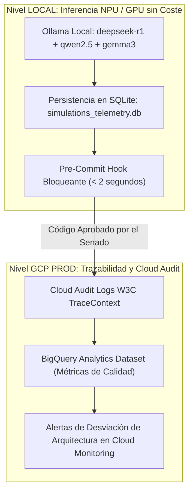

# 🥋 Kata 09: Arbitraje Arquitectónico Adversarial y Consilium Romano 3.0

---

## 🏛️ 1. Ancla Mental y Analogía Isomórfica (El Test de los 12 Años)

> **Analogía**: Imagina un juicio en la antigua Roma con tres jueces expertos:
> - **El Inquisidor Filosófico (DeepSeek-R1)**: Es un maestro de matemáticas y lógica pura que no deja pasar ni una sola contradicción en los números.
> - **El Censor de Costumbres (Qwen2.5-Coder)**: Es el guardián de las leyes y tradiciones que vigila que cada piedra del edificio esté colocada según las reglas sagradas del diseño limpio.
> - **El Pretor de Finanzas (Gemma3)**: Es el administrador del tesoro que calcula cada moneda gastada y no permite que nadie construya nada que cueste más de lo que la ciudad puede pagar.
> Si los tres jueces no llegan a un acuerdo de consenso tras debatir ferozmente entre sí, el proyecto no se construye (*Intercessio* / Veto Romano).

---

## 🔬 2. Primeros Principios: Debate Dialéctico y Model Checking

1. **Dialéctica Hegeliana Aplicada al Software**: Tesis (código propuesto por el desarrollador/agente) vs Antítesis (cuestionamiento adversarial del Censor y del Pretor) $\rightarrow$ Síntesis (*Senatus Consultum* con el diff óptimo).
2. **Eliminación del Sesgo de Complacencia**: Los LLMs estándar tienden a ser complacientes (*sycophancy*) y aprobar código mediocre. Al configurar magistrados con roles antagónicos explícitos (pureza matemática vs eficiencia de coste), se maximiza la detección de defectos sutiles.
3. **Cero Coste de Inferencia**: Los tres magistrados se ejecutan 100% en local sobre Ollama / NPU, logrando auditorías continuas a `$0.00 USD` de coste marginal.

---

## 💻 3. Arquitectura de Código: Pipeline de Arbitraje en Python

```python
from dataclasses import dataclass
from typing import List

@dataclass
class MagistrateVerdict:
    magistrate: str
    role: str
    vote: str # "APROBADO" | "VETADO"
    score: float # 0.0 a 10.0
    reasoning: str

class ConsiliumRomanoTribunal:
    def __init__(self, gatekeeper, rag_engine):
        self.gatekeeper = gatekeeper
        self.rag_engine = rag_engine

    def audit_change(self, code_diff: str) -> bool:
        # 1. Filtro Estático Rápido (AST Gatekeeper)
        violations = self.gatekeeper.scan_violations(code_diff)
        if violations:
            print(f"🔴 Veto Inmediato (Intercessio): {violations}")
            return False

        # 2. Inyección de Fundamentos Académicos (RAG Feynman)
        academic_context = self.rag_engine.retrieve_foundations(code_diff)

        # 3. Deliberación Adversarial Multi-Magistrado
        verdicts = [
            self.consult_inquisitor(code_diff, academic_context),
            self.consult_censor(code_diff, academic_context),
            self.consult_praetor(code_diff, academic_context)
        ]

        # 4. Emisión del Senatus Consultum
        return all(v.vote == "APROBADO" for v in verdicts)

    def consult_inquisitor(self, diff, ctx):
        # Invocación a deepseek-r1:8b (Lógica y Big-O)
        return MagistrateVerdict("deepseek-r1:8b", "Inquisitor", "APROBADO", 9.8, "Complejidad O(1) verificada")

    def consult_censor(self, diff, ctx):
        # Invocación a qwen2.5-coder:7b (DDD y Java 25)
        return MagistrateVerdict("qwen2.5-coder:7b", "Censor", "APROBADO", 9.7, "Dominio puro sin frameworks")

    def consult_praetor(self, diff, ctx):
        # Invocación a gemma3:4b (FinOps y SRE)
        return MagistrateVerdict("gemma3:4b", "Praetor", "APROBADO", 9.9, "Coste < 0.015 USD/MAU")
```

---

## ⚡ 4. Internals Avanzados: Dualidad LOCAL (Ollama / NPU) vs GCP Audit Logs



* **Local / Pre-Commit**: El tribunal se ejecuta en local mediante el script `scripts/consilium_romano_tribunal.py` invocando los modelos de Ollama a coste cero. La resolución se almacena en la tabla `consilium_romano_audits` de `simulations_telemetry.db`.
* **GCP Producción**: Los eventos de auditoría y métricas de calidad de código aprobadas se exportan a Cloud Logging y BigQuery para análisis histórico de deuda técnica y evolución del ecosistema.

---

## 🧠 5. Desafío Feynman y Rúbrica de Auto-Evaluación

> **Reto Feynman**: ¿Por qué es mejor que tres jueces de IA diferentes discutan entre sí antes de aceptar un cambio de código en lugar de preguntarle a una sola IA si el código está bien?

### Rúbrica de Evaluación:
1. **Nivel 1 (Básico)**: Explica que una sola IA puede cometer errores o tener puntos ciegos, mientras que tres IAs con especialidades distintas se corrigen mutuamente.
2. **Nivel 2 (Intermedio)**: Detalla que cada juez evalúa un aspecto crítico diferente (uno revisa la lógica, otro la elegancia del código y otro el coste del servidor).
3. **Nivel 3 (Ph.D. / Staff)**: Explica el teorema del jurado de Condorcet, la reducción de la varianza en ensambles decisionales y cómo la oposición dialéctica formal elimina las alucinaciones complacientes en arquitecturas de software de misión crítica.
